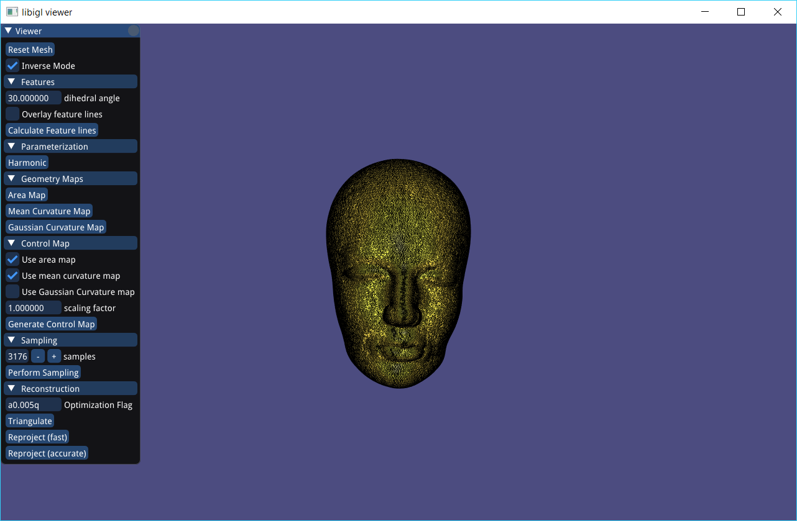

# Interactive Geometry Remeshing

#### Yicong Tao

## Project Description
In this project, I built a geometry remeshing software. The remeshing result can be processed and previewed at a fast speed, enabling interactive controlling of the remeshing quality and control map editing.

Below are the major steps involved in this pipeline:

1.	Mesh parametrization using Harmonic Parameterization
1.	Features extraction
1.	Control map design
1.	Control map sampling and preview
1.	Mesh creation through Delaunay triangulation
1.  Reproject 2D mesh into 3D

Currently, the input of this pipeline must be a mesh patch with genus-0 and a open boundary. The output of this pipeline is a new mesh which has the desired properties (e.g., uniform).
Libraries Used
  + libigl: http://libigl.github.io/libigl/

## Screenshot

## Reference
Pierre Alliez, Mark Meyer, and Mathieu Desbrun. 2002. Interactive geometry remeshing. ACM Trans. Graph. 21, 3 (July 2002), 347-354. DOI=http://dx.doi.org/10.1145/566654.566588
